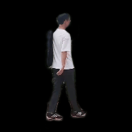
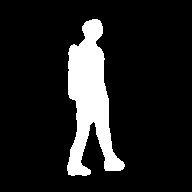
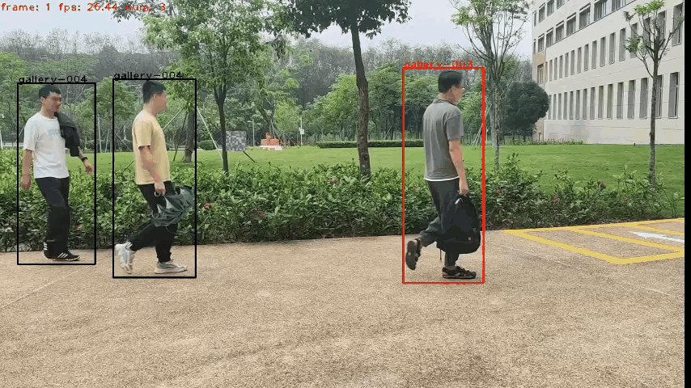

<div align="center"></div>

TrackGait is a sub-project of [OpenGait](https://github.com/ShiqiYu/OpenGait) provided by [Shiqi Yu Group](https://faculty.sustech.edu.cn/yusq/) that develops a gait recognition system.

🎉🎉🎉 **[*OpenGait*](https://arxiv.org/pdf/2211.06597.pdf) has been accpected by CVPR2023 as a highlight paper！** 🎉🎉🎉

## How to use
The workflow of TrackGait involves the proecesses of pedestrian tracking, segmentation and identification.

Users are encougraed to update the gait recognition models with watching the lastest SOTA methods in [OpenGait](https://github.com/ShiqiYu/OpenGait).

### A. Run in Colab (Recommended)
[](https://colab.research.google.com/drive/192ZJrRC8NxVAkowNWnMhkO7_q1uzkzS7?usp=sharing)

### B. Run on the host machine

#### Step1. Installation
```
git clone https://github.com/jdyjjj/TrackGait.git
cd TrackGait
pip install -r requirements.txt
pip install yolox
```
#### Step2. Get checkpoints
```
demo
   |——————checkpoints
   |        └——————bytetrack_model
   |        └——————gait_model
   |        └——————seg_model
   └——————libs
   └——————output


checkpoints
   |——————bytetrack_model
   |        └——————bytetrack_x_mot17.pth.tar
   |        └——————yolox_x_mix_det.py
   |
   └——————gait_model
   |        └——————xxxx.pt
   └——————seg_model
            └——————human_pp_humansegv2_mobile_192x192_inference_model_with_softmax
```

##### Get the checkpoint of gait model

```
cd TrackGait/OpenGait/demo/checkpoints
mkdir gait_model
cd gait_model
wget https://github.com/ShiqiYu/OpenGait/releases/download/v2.0/pretrained_grew_gaitbase.zip
unzip -j pretrained_grew_gaitbase.zip

```

##### Get the checkpoint of tracking model
```
cd TrackGait/OpenGait/demo/checkpoints/bytetrack_model
pip install --upgrade --no-cache-dir gdown
gdown https://drive.google.com/uc?id=1P4mY0Yyd3PPTybgZkjMYhFri88nTmJX5
```

This is the link of bytetrack, download it and put it in the folder "byte track_model"

- bytetrack_x_mot17 [[google]](https://drive.google.com/file/d/1P4mY0Yyd3PPTybgZkjMYhFri88nTmJX5/view?usp=sharing), [[baidu(code:ic0i)]](https://pan.baidu.com/s/1OJKrcQa_JP9zofC6ZtGBpw)

##### Get the checkpoint of segment model
```
cd TrackGait/OpenGait/demo/checkpoints
mkdir seg_model
cd seg_model
wget https://paddleseg.bj.bcebos.com/dygraph/pp_humanseg_v2/human_pp_humansegv2_mobile_192x192_inference_model_with_softmax.zip
unzip human_pp_humansegv2_mobile_192x192_inference_model_with_softmax.zip
```

#### Step3. Run demo
```
cd TrackGait/OpenGait
python demo/libs/main.py
```

TrackGait mainly consists of three processes, tracking, segment, and recognition. In main.py, you need to select two video inputs and specify one as the gallery and one as the probe to obtain the recognized results. In main.py, you need to select two video inputs and specify one as the gallery and one as the probe to obtain the recognized results. The specific video results can be viewed in path **"TrackGait/OpenGait/demo/output/Outputvideos/track_vis/{timestamp}"**.

#### Step4. See the result

```
cd TrackGait/OpenGait/demo/output

output
   └——————GaitFeatures: This stores the corresponding gait features
   └——————Inputvideos: This is the folder where the input videos are put
   |——————Outputvideos
   |        └——————track_vis
   |                └——————timestamp
   └——————silhouette: This stores the corresponding gait silhouette images
   └——————demo_video_result
   
```

**timestamp**: Store the result video of the track here, naming it consistent with the input video. In addition, videos with the suffix "- After. mp4" are obtained after gait recognition.

**demo_video_result**：The videos in this folder are all generated by main.py, where gallery.mp4 is the gallery, and the other probe After.mp4 are the result videos of gait recognition.**Among them, people with the same ID are those with the same bounding box color**.

<div align="center">
       
      
  
    
      
</div>

## Authors:

**OpenGait Team (OGT)**

- [Dongyang Jin(金冬阳)](https://faculty.sustech.edu.cn/?p=176498&tagid=yusq&cat=2&iscss=1&snapid=1&go=1&orderby=date), 11911221@mail.sustech.edu.cn
- [Chao Fan (樊超)](https://faculty.sustech.edu.cn/?p=128578&tagid=yusq&cat=2&iscss=1&snapid=1&orderby=date), 12131100@mail.sustech.edu.cn
- [Rui Wang(王睿)](https://faculty.sustech.edu.cn/?p=161705&tagid=yusq&cat=2&iscss=1&snapid=1&go=1&orderby=date), 12232385@mail.sustech.edu.cn
- [Chuanfu Shen (沈川福)](https://faculty.sustech.edu.cn/?p=95396&tagid=yusq&cat=2&iscss=1&snapid=1&orderby=date), 11950016@mail.sustech.edu.cn
- [Junhao Liang (梁峻豪)](https://faculty.sustech.edu.cn/?p=95401&tagid=yusq&cat=2&iscss=1&snapid=1&orderby=date), 12132342@mail.sustech.edu.cn

## Acknowledgement
- Gait Recognition: [OpenGait](https://github.com/ShiqiYu/OpenGait)
- Pedestrian Tracking: [ByteTrack](https://github.com/ifzhang/ByteTrack)
- Pedestrian Segementation: [PaddleSeg](https://github.com/PaddlePaddle/PaddleSeg)

## Citation
```
@misc{fan2022opengait,
      title={OpenGait: Revisiting Gait Recognition Toward Better Practicality}, 
      author={Chao Fan and Junhao Liang and Chuanfu Shen and Saihui Hou and Yongzhen Huang and Shiqi Yu},
      year={2022},
      eprint={2211.06597},
      archivePrefix={arXiv},
      primaryClass={cs.CV}
}
```

**Note:**
This code is only used for **academic purposes**, people cannot use this code for anything that might be considered commercial use.
